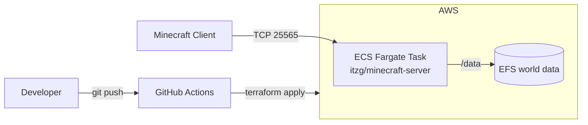

# Course Project Part 2 

Automated deployment of a Minecraft server on AWS using Terraform, ECS Fargate, EFS, and GitHub Actions. No AWS Management Console required.

## Requirements

| Tool | Version |
|---|---|
| [Terraform](https://developer.hashicorp.com/terraform/install) | ≥ 1.10 |
| [AWS CLI](https://docs.aws.amazon.com/cli/latest/userguide/getting-started-install.html) | v2 |
| [Git](https://git-scm.com/downloads) | ≥ 2.x |
| [nmap](https://nmap.org/download.html) | ≥ 7.x |

**AWS credentials** (AWS Academy Learner Lab): start the lab, open **AWS Details → AWS CLI: Show**, paste the block into `~/.aws/credentials`, then set the region:

```bash
aws configure set region us-east-1
```

Credentials expire when the lab session ends — refresh them each session.

**GitHub Actions secrets** (for the CI/CD pipeline): add `AWS_ACCESS_KEY_ID`, `AWS_SECRET_ACCESS_KEY`, and `AWS_SESSION_TOKEN` under **Settings → Secrets and variables → Actions**, using the same Learner Lab values.

## Pipeline Overview



1. **Bootstrap** (one-time) — create the S3 bucket holding Terraform's remote state, shared by local runs and CI.
2. **Provision** — Terraform creates the security groups, EFS file system, ECS cluster, task definition, and service. The server runs as the `itzg/minecraft-server` Docker image on Fargate; world data is mounted from EFS so it survives container replacement. Runs locally via script or automatically on push to `main` through GitHub Actions.
3. **Verify** — a script finds the Fargate task's public IP via the AWS CLI and checks port 25565 with `nmap`.
4. **Destroy** — `terraform destroy` removes everything.

The ECS service keeps one task running (auto-restart on failure). On shutdown, ECS sends `SIGTERM`; the image runs Minecraft's `stop` command and `stopTimeout = 120` gives the world save time to finish.

## Tutorial

```bash
git clone https://github.com/gnavadev/minecraft-iac.git
cd minecraft-iac
```

**1. Bootstrap the state bucket** (one-time; bucket names are global, pick a unique one and set it in `terraform/backend.tf` → `bucket`):

```bash
./scripts/00-bootstrap-state.sh <unique-bucket-name>
```

**2. Deploy** — either locally:

```bash
./scripts/10-deploy.sh
```

or push to `main` (or use **Actions → Deploy Minecraft Server → Run workflow**) and GitHub Actions runs the same `terraform init / validate / apply`.

**3. Get the server address** (first start takes 2–4 minutes):

```bash
./scripts/20-get-server-ip.sh
```

Expected output:

```
PORT      STATE  SERVICE    VERSION
25565/tcp open   minecraft  Minecraft 1.21.x
```

**4. Connect:** open the Minecraft client → **Multiplayer → Add Server** → enter `<public-ip>:25565`. The IP changes when the task is replaced; re-run step 3 to get the current one.

**5. Stop the server** (keeps infrastructure and world data):

```bash
aws ecs update-service --cluster minecraft-cluster --service minecraft-service --desired-count 0
```

**6. Tear down everything:**

```bash
./scripts/30-destroy.sh
```

## Resources / Sources

- [itzg/minecraft-server documentation](https://docker-minecraft-server.readthedocs.io/)
- [Terraform AWS Provider documentation](https://registry.terraform.io/providers/hashicorp/aws/latest/docs)
- [Amazon ECS Developer Guide](https://docs.aws.amazon.com/AmazonECS/latest/developerguide/)
- [Amazon EFS User Guide](https://docs.aws.amazon.com/efs/latest/ug/whatis.html)
- [Terraform S3 backend](https://developer.hashicorp.com/terraform/language/backend/s3)
- [hashicorp/setup-terraform GitHub Action](https://github.com/hashicorp/setup-terraform)
- Course Project Part 1 (manual EC2 deployment this project automates)
